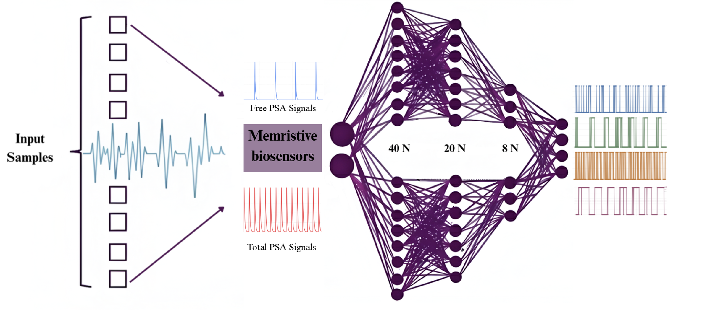
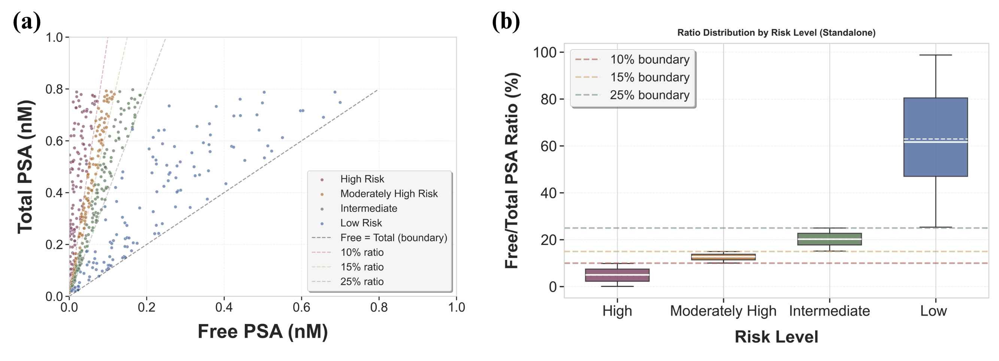
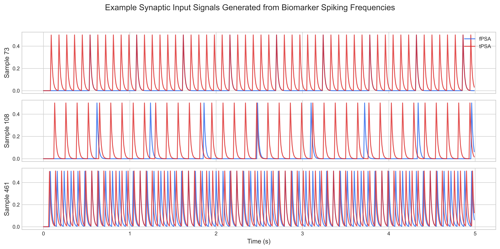
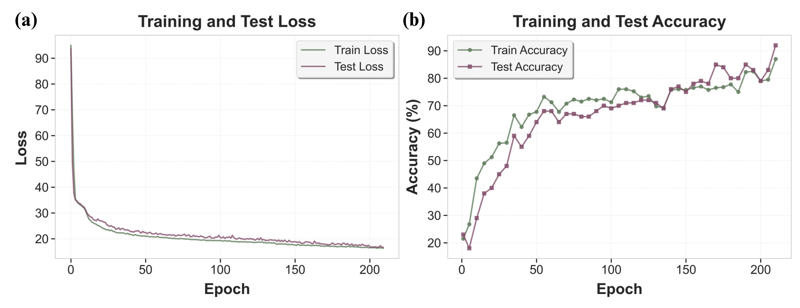
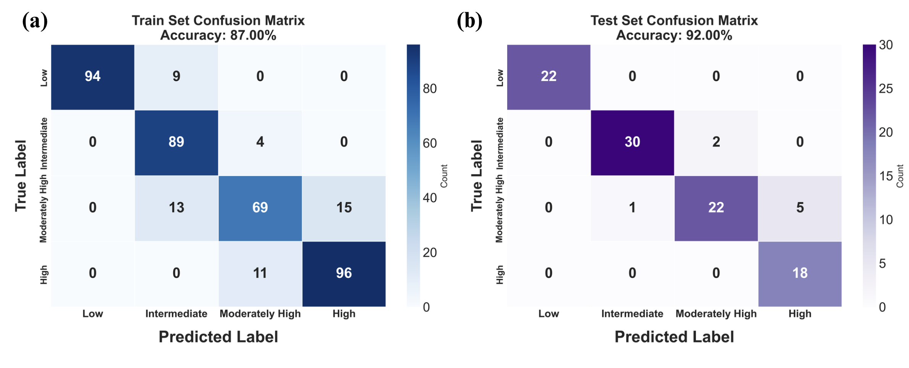
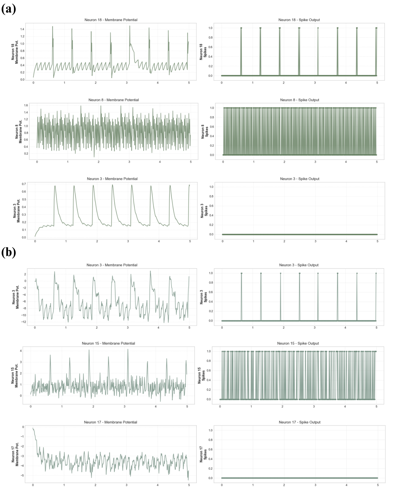
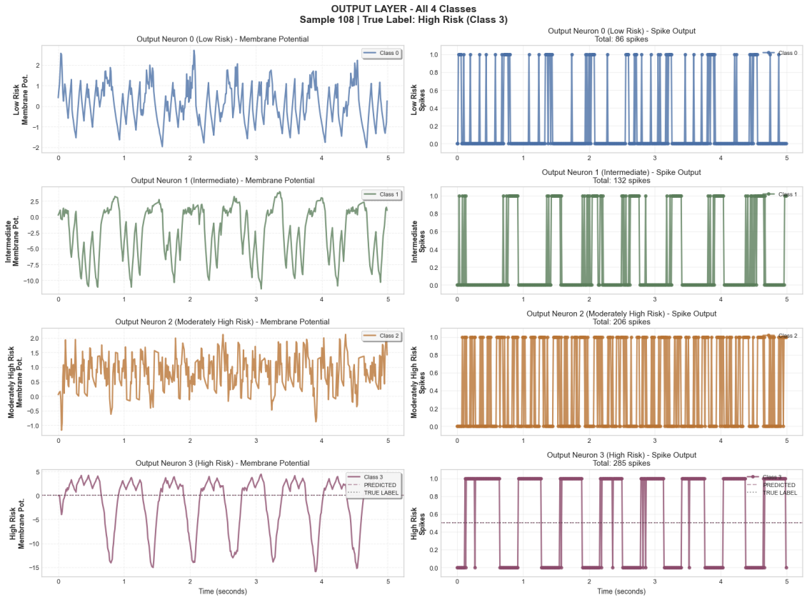

# Neuromorphic Biosignal Prescreening


This project implements a Spiking Neural Network (SNN) based system for analyzing Prostate-Specific Antigen (PSA) biomarker data to classify prostate cancer risk levels. The system converts biomarker concentration measurements to frequency-domain signals, encodes them as spike trains, and uses a neuromorphic architecture for energy-efficient classification.



*Schematic diagram of the neuromorphic biosignal prescreening system (from "An Energy-Efficient Neuromorphic Front-End for Risk Pre-Screening Using Pulse-Encoded Biosensor Signals")*


### Workflow

The complete workflow consists of the following stages:

1. **Data Generation**: A dataset of 500 samples is generated for different classes of prostate cancer risk based on Free PSA and Total PSA measurements. The data distribution across risk categories is shown below:



2. **Signal Encoding**: The biomarker frequency measurements are converted to synaptic signals through pulse encoding, generating spike train representations as illustrated:



3. **Network Architecture**: The data is split into 80% training and 20% testing sets. A 3-layer Spiking Neural Network is trained with the following architecture:
   - **Layer 1**: 40 neurons
   - **Layer 2**: 20 neurons  
   - **Layer 3**: 8 neurons (output layer)
   
   The network architecture is depicted in the graphical abstract.

4. **Training & Results**: The network achieves the following performance:
   - **Training Loss Curve**: 
   
   
   
   - **Test Accuracy**: 92% on 100 test samples
   - **Confusion Matrix**:
   
   

5. **Neuron-Level Visualization**: For individual patient samples, the spike activity within each neuron can be visualized:



6. **Output Layer Activity**: The final output neuron responses for classification:



### Key Features

- **Pulse Encoding**: Converts biomarker frequency measurements to spike train representations
- **Neuromorphic Inference**: Implements multi-layer Spiking Neural Networks using `snntorch`
- **Risk Classification**: Classifies samples into four risk categories based on Free/Total PSA ratios:
  - High Risk (ratio < 10%)
  - Moderately High Risk (ratio 10-15%)
  - Intermediate (ratio 15-25%)
  - Low Risk (ratio > 25%)
- **Signal Processing**: Synaptic filtering and temporal pooling for signal preprocessing
- **Comprehensive Visualization**: Professional plots for signal flow, confusion matrices, and performance metrics
- **Reproducibility**: Built-in seed management for consistent results

## Project Structure

```
neuromorphic-biosignal-prescreening/
├── SNN_Core.py              # Main SNN implementation and workflow class
├── SNN_Workflow.py          # Example workflow scripts
├── Data_Generator.py        # Synthetic PSA biomarker data generation
├── EDA_Tool.py              # Exploratory Data Analysis and visualization tools
├── Free_Total_PSA_frequency.csv  # Sample dataset (500 samples)
├── SNN_3_LAYER.pth          # Pre-trained model checkpoint
├── figures/                 # Visualization figures
│   ├── Schematic.png        # System schematic diagram
│   ├── Data_distribution.png # Data distribution across risk categories
│   ├── fig_signal_inputs.png # Synaptic signal inputs
│   ├── fig_loss_curve.png   # Training loss curve
│   ├── fusion.png           # Confusion matrix
│   ├── fig_spikes1.png      # Individual neuron spike activity
│   └── output_neuron.png    # Output neuron responses
├── LICENSE.txt              # MIT License
└── README-2.md              # This file
```

## Installation

### Requirements

The project requires Python 3.7+ and the following packages:

```bash
pip install torch
pip install snntorch
pip install numpy
pip install pandas
pip install matplotlib
pip install seaborn
pip install scikit-learn
pip install scipy
```

### Quick Setup

1. Clone the repository:
```bash
git clone <https://github.com/APMaii/neuromorphic-biosignal-prescreening>
cd neuromorphic-biosignal-prescreening
```

2. Install dependencies:
```bash
pip install -r requirements.txt
```


## Usage

### Quick Start: Full Pipeline

The easiest way to run the complete workflow is using the full pipeline:

```python
from SNN_Core import SNN_BioMarker

# Initialize with your data path
path = 'Free_Total_PSA_frequency.csv'
snn_model = SNN_BioMarker(path, dpi=600)

# Run the complete pipeline
snn_model.run_full_pipeline(
    dt=1e-2, T=5, a=0.5, target_length=25,
    downsampled_signals=False,
    split_ratio=0.8, batch_size=8, num_epochs=210,
    num_layers=3, num_hidden1=40, num_hidden2=20, num_hidden3=8,
    beta=0.9, correct_rate=0.8, incorrect_rate=0.2,
    lr=1e-3, betas=(0.9, 0.999),
    generation_method='5',
    save_model=True, model_name='SNN_3_LAYER'
)

# Visualize signal flow for a sample
snn_model.visualize_signal_flow2(sample_idx=108)
```

### Manual Step-by-Step Workflow

For more control, you can run each step individually:

```python
from SNN_Core import SNN_BioMarker

# Initialize
path = 'Free_Total_PSA_frequency.csv'
snn_model = SNN_BioMarker(path, dpi=600)

# Step 1: Generate synaptic signals
snn_model.generate_synaptic_signals(dt=1e-2, T=5, a=0.5)

# Step 2: Create labels
snn_model.labeling_y()

# Step 3: Convert to PyTorch tensors
snn_model.convert_to_torch_tensor(downsampled_signals=False)

# Step 4: Create dataset
snn_model.create_dataset()

# Step 5: Split dataset
snn_model.split_dataset(split_ratio=0.8)

# Step 6: Create data loaders
snn_model.create_data_loaders(batch_size=8)

# Step 7: Create network
snn_model.create_network(
    num_layers=3, num_hidden1=40, num_hidden2=20, num_hidden3=8, beta=0.9
)

# Step 8: Create loss function
snn_model.create_loss_function(correct_rate=0.8, incorrect_rate=0.2)

# Step 9: Create optimizer
snn_model.create_optimizer(lr=1e-3, betas=(0.9, 0.999))

# Step 10: Training
snn_model.training_loop(num_epochs=210)

# Step 11: Evaluation
snn_model.final_evaluation()

# Step 12: Visualizations
snn_model.plot_loss_curves()
snn_model.plot_confusion_matrix()
snn_model.test_single_prediction()
snn_model.visualize_signal_flow2(sample_idx=108)

# Step 13: Save model
snn_model.save_model(model_name='SNN_3_LAYER')
```

### Loading a Pre-trained Model

```python
from SNN_Core import SNN_BioMarker

# Initialize with data path
data_path = 'Free_Total_PSA_frequency.csv'
snn_model = SNN_BioMarker(data_path, dpi=600)

# Load pre-trained model
model_path = 'SNN_3_LAYER.pth'
snn_model.load_model(model_path)

# Run analysis
snn_model.plot_loss_curves()
snn_model.plot_confusion_matrix()
snn_model.test_single_prediction()
snn_model.visualize_signal_flow2(sample_idx=9)
```

## Data Generation

Generate synthetic PSA biomarker data using the provided script:

```python
python Data_Generator.py
```

This script generates a balanced dataset of **500 samples** distributed across four prostate cancer risk categories:
- Generates Free PSA and Total PSA concentrations (in nM) within the range of 0.01-0.8 nM
- Converts concentrations to frequencies using: `frequency = (10^6.63) * (concentration_M^0.6)`
- Categorizes samples into risk levels based on Free/Total PSA ratios:
  - **High Risk**: ratio < 10% (125 samples)
  - **Moderately High Risk**: ratio 10-15% (125 samples)
  - **Intermediate**: ratio 15-25% (125 samples)
  - **Low Risk**: ratio > 25% (125 samples)
- Exports data to `Free_Total_PSA_frequency.csv`

The data distribution visualization is available in `figures/Data_distribution.png`.

## Exploratory Data Analysis

Perform comprehensive data analysis and visualization:

```python
python EDA_Tool.py
```

The EDA tool provides:
- Concentration space visualizations (Free vs Total PSA)
- Frequency space visualizations
- Distribution histograms
- Log-log relationship validation
- Risk level distribution analysis with box plots

## Key Components

### SNN_BioMarker Class

The main class that orchestrates the entire workflow:

- **Signal Generation**: Converts frequency measurements to spike trains with synaptic filtering
- **Network Architecture**: Supports 1, 2, or 3-layer SNN architectures
- **Training**: Implements spike-based loss functions and optimization
- **Evaluation**: Provides comprehensive metrics and visualizations
- **Visualization**: Generates publication-quality plots

### Network Architectures

The system supports three network configurations:
- `CancerNet_1layer`: Single-layer SNN
- `CancerNet_2layer`: Two-layer SNN
- `CancerNet_3layer`: Three-layer SNN (default)

### Signal Processing

- **Spike Generation**: Converts frequency to periodic spike trains
- **Synaptic Filtering**: Applies exponential decay filtering: `x[t] = spike[t] + a * x[t-1]`
- **Temporal Pooling**: Optional downsampling for computational efficiency

## Parameters

### Signal Generation Parameters
- `dt`: Sampling time (default: 1e-2)
- `T`: Signal duration in seconds (default: 5)
- `a`: Synaptic decay constant (default: 0.5)
- `generation_method`: Signal generation method ('1' to '5', default: '5')

### Network Parameters
- `num_layers`: Number of hidden layers (1, 2, or 3)
- `num_hidden1/2/3`: Number of neurons in each hidden layer
- `beta`: Leaky integrate-and-fire neuron decay parameter

### Training Parameters
- `num_epochs`: Number of training epochs (default: 210)
- `batch_size`: Batch size for training (default: 8)
- `lr`: Learning rate (default: 1e-3)
- `correct_rate`: Reward for correct predictions (default: 0.8)
- `incorrect_rate`: Penalty for incorrect predictions (default: 0.2)

## Results

### Performance Metrics

The trained 3-layer SNN (40-20-8 architecture) achieves the following results:

- **Test Accuracy**: **92%** on 100 test samples
- **Training**: 400 samples (80% split)
- **Testing**: 100 samples (20% split)
- **Epochs**: 210 training epochs

### Visualizations

The system generates comprehensive visualizations:

1. **Training Metrics**: Loss curves showing convergence over training epochs (see `figures/fig_loss_curve.png`)
2. **Confusion Matrix**: Classification performance across all four risk categories (see `figures/fusion.png`)
3. **Signal Flow Visualizations**: 
   - Synaptic signal inputs (see `figures/fig_signal_inputs.png`)
   - Individual neuron spike activity (see `figures/fig_spikes1.png`)
   - Output neuron responses (see `figures/output_neuron.png`)
4. **Model Checkpoints**: Saved PyTorch models (`.pth` files)
5. **Classification Reports**: Detailed per-class metrics and accuracy breakdowns

## Reproducibility

The code includes built-in reproducibility features:
- Global random seed management (default: 42)
- Deterministic PyTorch operations
- Seed setting utilities for consistent results

## License

This project is licensed under the MIT License - see the [LICENSE.txt](LICENSE.txt) file for details.

Copyright (c) 2026 Ali Pilehvar Meibody

## Citation

If you use this code in your research, please cite the associated publication:

```bibtex
@article{pilehvar_meibody_2026,
  title={An Energy-Efficient Neuromorphic Front-End for Risk Pre-Screening Using Pulse-Encoded Biosensor Signals},
  author={Pilehvar Meibody, Ali},
  journal={Your Journal},
  year={2026}
}
```

## Contact

For questions or issues, please open an issue on the repository or contact the author.

## Acknowledgments

This work is part of a Master's thesis project on neuromorphic computing for biosignal processing.
